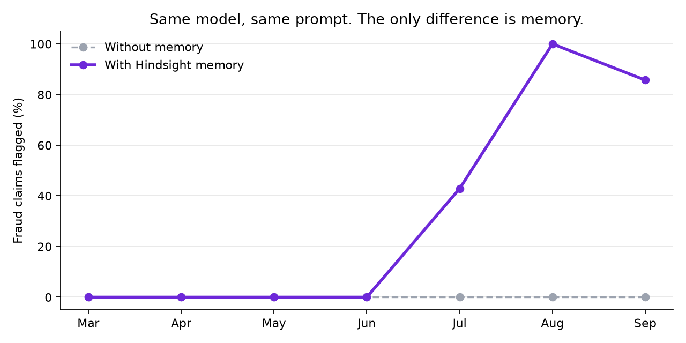
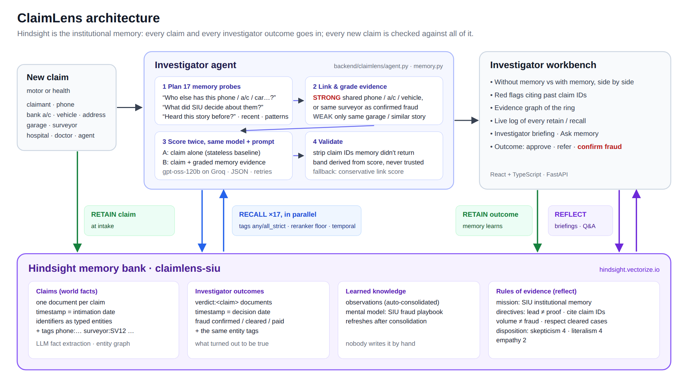

# ClaimLens

**Claims triage that remembers every claim it has ever seen.**

[](https://github.com/rishighosal/claimlens/actions/workflows/ci.yml)


<!-- DEMO-VIDEO: replace this comment with:  **[▶ Watch the 3-minute demo](https://youtu.be/...)** -->
<!-- DEMO-SITE: replace this comment with:  **[Try the recorded demo in your browser](https://rishighosal.github.io/claimlens/)** (real results from a live run; no install) -->

Organised insurance fraud is invisible one claim at a time. A staged "unknown vehicle hit me from behind" at a Moosapet garage looks exactly like a genuine accident. It stops looking genuine once you notice that the same surveyor handled ten others like it, two "unrelated" claimants share a phone number, and the payee bank account is on a claim that investigators already repudiated.

A normal LLM triage bot starts from zero on every claim. ClaimLens is a fraud-triage agent for an insurer's Special Investigation Unit (SIU) that uses **[Hindsight](https://github.com/vectorize-io/hindsight) as its institutional memory**. Every claim and every investigator outcome goes into memory, and every new claim is checked against all of it.

## Result: same model, same prompt; the only difference is memory



| Replay of 9 months of claims, in date order | Without memory | With Hindsight |
|---|---|---|
| Fraud claims flagged, Aug–Sep | 0 / 12 | **11 / 12** |
| Fraud claims flagged, whole year | 0 / 33 | 14 / 33 |
| Genuine claims wrongly flagged | 0 | **0** |
| Fraud value flagged | ₹0 | **₹36.7 lakh** |

The agent **learns**. It catches nothing while a ring is new and nothing is confirmed (March–June), which is correct. Once investigators confirm the first cases in July, Hindsight recalls those outcomes and the agent catches the rest of the ring: **43% → 100% → 86%**, without flagging a single honest claim. [How the replay works ↓](#does-memory-actually-help-replay-evaluation)

## Why it matters

- Indian insurers lose an estimated **₹8,000–10,000 crore a year**, 8–10% of claim payouts, to fraud, waste and abuse ([BCG × Medi Assist, Nov 2025](https://www.business-standard.com/industry/news/insurance-fwa-drains-rs10000cr-each-year-bcg-mediassist-report-125112101199_1.html)).
- **IRDAI's Insurance Fraud Monitoring Framework Guidelines, 2025** (in force from 1 April 2026) require every insurer to run a Fraud Monitoring Unit, maintain red-flag indicators and an incident database, and share fraud data with the IIB caution repository ([summary](https://taxguru.in/corporate-law/irdai-insurance-fraud-monitoring-framework-guidelines-2025.html)).
- Rings are exactly what per-claim rules and stateless models miss. The evidence isn't in any one file; it's in the history. ClaimLens is the memory a Fraud Monitoring Unit needs: it connects a new claim to every person, provider, story and verdict the unit has already seen, and it gets better with every case the unit closes.

## What it looks like on real claims (live run, `gpt-oss-120b`)

| Claim | Without memory | With Hindsight | Why |
|---|---|---|---|
| #10595: night-time hit-and-run, Sri Balaji Auto Works | 15 · Fast-track | **87 · Refer to SIU** | Payee account is on #10566 and phone is on #10572, both repudiated by SIU; same surveyor as the confirmed ring claims |
| #10606: same ring, 9 days later, *after* #10595 was confirmed in the UI | 15 · Fast-track | **85 · Refer to SIU** | Evidence now includes #10595, the case closed a minute earlier. One retain call, no retraining. |
| #10614: *honest* claim at the ring's own garage, different surveyor | 15 · Fast-track | **22 · Fast-track** | Shares only the garage; no personal identifier. Graded WEAK, correctly not flagged. |
| #10597: Creta TS08FK4521, same front-left damage, new owner | 15 · Fast-track | **75 · Refer to SIU** | Same vehicle claimed identical damage in February and June under other policies |

## What's new here

1. **Outcomes are memories.** Investigator decisions are retained as their own dated documents with the same entity tags as the claim. That's what turns recall into *learning*: the agent is judged against what turned out to be true, not just what people said.
2. **Memory as investigator questions.** Each claim gets 15–17 targeted recalls, run in parallel: *who else has this phone / account / vehicle / address / surveyor…*, *what did SIU decide about them*, *have we heard this story before*, *what happened around this time*, *which patterns match*.
3. **Evidence is graded before the model sees it.** Every recalled link is labelled STRONG (a shared personal identifier, or the same surveyor/doctor as *confirmed* fraud) or WEAK (only a shared garage or a similar story). That's why the honest claim at the fraud garage stays at 22.
4. **Measured, not claimed.** A leak-free replay ablation compares the same model with and without memory, and measures the learning curve.
5. **Rules of evidence live in the memory bank.** Hindsight directives: a pattern is a lead, not proof; cite claim IDs; volume is not fraud; respect cleared cases. Any claim ID the model cites that memory didn't return is stripped.

## Architecture



## How Hindsight is used

Full write-up: **[docs/HINDSIGHT.md](docs/HINDSIGHT.md)**. Code: [`backend/claimlens/memory.py`](backend/claimlens/memory.py).

| Hindsight feature | How ClaimLens uses it |
|---|---|
| **retain** with `document_id`, `timestamp`, `entities`, `tags`, `metadata` | Each claim is retained at intake (timestamp = intimation date). Each investigator outcome is retained as its own `verdict:<claim>` document at the date it was decided. Hard identifiers (phone, payee account, vehicle, address, garage, surveyor, hospital, doctor, agent) are passed as typed **entities** *and* as **tags**. |
| **recall**, `tags` + `tags_match="any_strict"` | Exact linking: one recall per identifier. This is how two claimants who never met turn out to share a bank account. |
| **recall**, `tags=["verdict", <entity>]` + `all_strict` | "What did SIU decide about this surveyor / phone / vehicle?" Outcomes are fetched explicitly, so a fresh verdict is never crowded out. |
| **recall**, semantic + keyword + graph arms, reranked, `min_scores={"reranker": 0.55}` | "Have we heard this story before?" Finds templated narratives across different people; the reranker floor stops weak matches from becoming links. |
| **recall**, `temporal_window` + `query_timestamp` | "What happened around this time?" The replay anchors recall at the claim's date so memory never sees the future; the live app anchors at *now*, so today's verdicts count. |
| **recall**, `types=["observation"]` | Hindsight's auto-consolidated observations: patterns merged across many claims. |
| **reflect** with mission, **directives** and disposition | Investigator briefings and free-form questions ("What do the Lifeline claims have in common?"), under SIU rules of evidence. Disposition: skepticism 4, literalism 4, empathy 2. |
| **mental model**, `refresh_after_consolidation` | The *SIU fraud playbook*: a living summary of confirmed modus operandi and cleared look-alikes. Nobody writes it; it rebuilds as outcomes arrive. |
| **retain_mission / observations_mission** | Tells Hindsight what matters when extracting facts from claim files, and what to consolidate. |

## Does memory actually help? (replay evaluation)

`scripts/replay_eval.py` replays all 215 claims **in date order** into a fresh bank. Before each claim is retained, it is scored twice by the same model with the same prompt: once alone, once with Hindsight recall. Investigator outcomes enter memory on the day they were decided, so memory never sees the future. The replay runs in strict mode: no deterministic fallback, and both arms always use the same model. Ground truth is used only for scoring.

```bash
python scripts/replay_eval.py --sample 70 --pace 10
```

**Results** (70 scored: all 33 fraud + 37 random genuine; `openai/gpt-oss-120b` on Groq; flag = risk ≥ 61). Full tables in [`data/eval/results.md`](data/eval/results.md).

| | Without memory | With Hindsight |
|---|---|---|
| Fraud flagged, whole year | 0 / 33 | 14 / 33 |
| Fraud flagged, Aug–Sep | 0 / 12 | **11 / 12** |
| Genuine claims flagged | 0 | **0** |
| ROC AUC | 0.46 | 0.79 |
| Fraud value flagged | ₹0 | ₹36,74,500 |

| Month | Mar | Apr | May | Jun | Jul | Aug | Sep |
|---|---|---|---|---|---|---|---|
| Fraud flagged with memory | 0% | 0% | 0% | 0% | 43% | 100% | 86% |
| Fraud flagged without memory | 0% | 0% | 0% | 0% | 0% | 0% | 0% |

**Limitations, honestly.**
- Early ring claims are missed by design. They were paid before anyone noticed, and "same garage, same surveyor, previous claims approved" is not evidence.
- The recycled-vehicle repeats scored 45, "standard review" rather than "refer": with nothing confirmed about that car, the agent escalates to review, not SIU.
- The data is synthetic (see below). A real deployment would replay the insurer's own closed claims the same way.

## Data

`scripts/generate_data.py` builds a seeded, realistic dataset: 215 motor and health claims from Hyderabad, January to September 2026. It uses real areas, police stations, IFSC-style accounts and IDVs, with invented people and businesses. Four fraud patterns are hidden inside, plus decoys: a high-volume but clean authorised dealer, and genuine claims at the fraud garage handled by other surveyors. The agent has to learn *combinations*, not "this garage is bad".

| Ring | Pattern | Why one-claim review misses it |
|---|---|---|
| R1 | Garage + surveyor collusion: staged night-time rear-end hits, inflated repairs | Each story is plausible; only the repeated surveyor, shared phones/accounts and templated wording give it away |
| R2 | Hospital admission ring: 1–2 day weekend admissions on 5-week-old policies from one agent | Each admission is medically plausible |
| R3 | Early-claim intermediary: old cars insured at high IDV, "stolen"/"burnt" within 3 weeks, one apartment block | Early claims happen; the address cluster doesn't show on one file |
| R4 | Recycled damage: same vehicle, same damage, new owner | Different policy, different garage |

## Run it

Requirements: Python 3.11+, Node 18+, a [Hindsight Cloud](https://ui.hindsight.vectorize.io) API key (or self-hosted Hindsight) and a [Groq](https://groq.com) key (any OpenAI-compatible endpoint works).

```bash
cp .env.example .env              # add HINDSIGHT_API_KEY and GROQ_API_KEY
pip install -r requirements.txt
(cd frontend && npm install && npm run build)

python scripts/check_llm.py       # confirms which models your key can use
python scripts/seed_memory.py     # configure the bank + load Jan–Aug history (~6 min)
uvicorn claimlens.api:app --app-dir backend --port 8000
# open http://localhost:8000: it opens on "The problem", then a guided demo
```

Offline UI development without keys: `CLAIMLENS_FAKE_MEMORY=1 CLAIMLENS_FAKE_LLM=1 uvicorn ...`. This uses naive in-process stand-ins, clearly bannered in the UI, not Hindsight.

**Tests:** `pytest` (22 tests, no network; run in CI on every push). `tests/test_hindsight_contract.py` pushes every memory call through the real `hindsight-client` request models with only HTTP stubbed.

**Robustness:**
- The model is asked for JSON; there's no function calling to break.
- Responses go through lenient parsing.
- Rate limits are waited out using `Retry-After`, and missing models are skipped.
- JSON mode alternates off on retries, and a chain of backup models follows.
- Last comes a conservative link-analysis score that counts only shared personal identifiers and links to confirmed fraud.
- The band is always derived from the score, never taken from the model.
- One failed recall probe never sinks an investigation.

## Repo map

```
backend/claimlens/
  memory.py        Hindsight bank setup, retain/recall/reflect, 17 probes, op log
  agent.py         investigator: STRONG/WEAK grading, prompts, validation, graph
  claims.py        claims system of record, rendering, entity extraction
  llm.py           defensive OpenAI-compatible client (rate limits, model chain)
  api.py           FastAPI routes + static UI
scripts/           generate_data · seed_memory · replay_eval · check_llm
frontend/src/      React + TypeScript UI (no UI libraries)
docs/              HINDSIGHT.md · DEMO.md · PITCH.md (talk track + judge Q&A) · ClaimLens-pitch.pptx · architecture
tests/             pytest suite
```

ClaimLens recommends; people decide. It never repudiates a claim on its own.

MIT licensed. Built with [Hindsight agent memory](https://github.com/vectorize-io/hindsight) by Vectorize.
